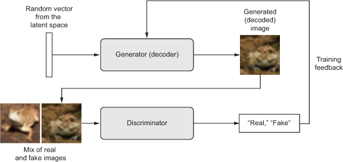

# Generative Adverserial Networks for MNIST

This is an example of different adversarial architectures including [Deep convolution generative adversarial networks](https://arxiv.org/abs/1511.06434) with the [Impvroved techniques for training](https://arxiv.org/abs/1606.03498) 
and the original paper of [Generative Adversarial Networks](https://arxiv.org/abs/1406.2661).  
## Introduction
Generative Adverserial networks were a new framework proposed to estimate generative models via adversarial process.
We simultaneously train two models:
* Generative model (G): It captures the data distribution and it's aim is to generate natural looking images similar to original data. It is like a counterfeit generating fake currency.
* Discriminative model (D): It estimates proability that the input is from the dataset or has been artificially created by G. It is like police detecting the fake or real currency. The training procedure for G is to maximize probability of D making a mistake.



## Setup Instructions

1. Clone the repository. 
```
git clone https://github.com/divyam3897/gans.git
```
2. Make sure tha you have Jupyter Notebook installed. You can install Anaconda (which installs Python, Jupyter Notebook, and a bunch of other useful computing libraries) or use pip.

- To install [Anaconda](https://www.continuum.io/downloads).

- If you want to install using pip, update pip with the following code (Replace pip with pip3 if using Python 3). 

On Linux/Mac OS:
```
pip install -r requirements.txt
```

You should be able to run the following. 
```
pip install jupyter
```

3. Run the following command to open the jupyter notebook in the browser.
```
jupyter notebook
```

For more resources on Jupyter Notebooks, check out the following:
* [Installation Documentation](http://jupyter.readthedocs.io/en/latest/install.html)
* [Trying Jupyter](https://try.jupyter.org/) just in your browser
* [Jupyter Docs](https://jupyter.readthedocs.io/en/latest/index.html)
